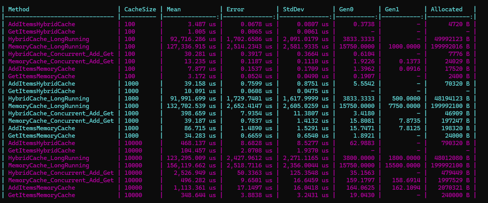

# HybridCacheLibrary

## Overview

**HybridCacheLibrary** is a custom caching library implemented in C#. This library provides two types of hybrid caching mechanisms: **Count-Based Hybrid Cache** and **Size-Based Hybrid Cache**. These caches combine the benefits of both Least Recently Used (LRU) and Least Frequently Used (LFU) cache eviction policies. The library is optimized for performance, ensuring fast add and retrieval operations while managing cache capacity dynamically. It also includes thread safety mechanisms, making it suitable for concurrent environments.

## Features

- **Count-Based Hybrid Caching Mechanism**: Combines LRU and LFU strategies for efficient cache eviction based on the number of items.
- **Size-Based Hybrid Caching Mechanism**: Manages cache eviction based on the total size of the items stored, allowing for dynamic size management.
- **Thread-Safe Operations**: Built-in thread safety to handle concurrent add and get operations.
- **Dynamic Capacity Management**: Supports dynamic cache resizing with an option to shrink the cache size.
- **Customizable Frequency Settings**: Allows setting custom frequency values for cache items to prioritize eviction.
- **Object Pooling**: Utilizes object pooling to optimize memory usage and improve performance.
- **Benchmarking**: Includes benchmark tests to compare performance against `MemoryCache`.

## Project Structure

```plaintext
HybridCacheLibrary/
│
├── HybridCacheLibrary/
│   ├── BaseHybridCache.cs
|   ├── ICache.cs
│   ├── CacheSizeType.cs
│   ├── CountBasedHybridCache.cs
│   ├── SizeBasedHybridCache.cs
│   ├── HybridCacheEnumerator.cs
│   ├── Node.cs
│   ├── NodePool.cs
│   └── ObjectSizeCalculator.cs
│
├── HybridCacheLibrary.Tests/
│   ├── CountBased/
│   │   ├── HybridCacheTests.cs
│   │   └── RealWorldTests.cs
│   └── SizeBased/
│       └── HybridCacheTests.cs
│
└── HybridCacheLibrary.Benchmark/
    └── Program.cs
```

## Installation

To use **HybridCacheLibrary** in your project, you can include the library as a reference in your `.NET` project.

```bash
git clone https://github.com/Andronovo-bit/HybridCacheLibrary.git
```

## Usage

### Basic Usage

#### Count-Based Hybrid Cache

```csharp
using HybridCacheLibrary;

var countCache = new CountBasedHybridCache<int, string>(100);

// Adding items
countCache.Add(1, "Value1");
countCache.Add(2, "Value2", 5); // Add with custom frequency

// Retrieving items
var value = countCache.Get(1);
Console.WriteLine(value); // Output: Value1

// Checking frequency
int frequency = countCache.GetFrequency(1);
Console.WriteLine(frequency); // Output: 2

// Eviction
countCache.SetCapacity(50, shrink: true);
```

#### Size-Based Hybrid Cache

```csharp
using HybridCacheLibrary;

var sizeCache = new SizeBasedHybridCache<int, string>(30, CacheSizeType.Megabytes); // 30 MB cache

// Adding items
sizeCache.Add(1, new string('a', 1024)); // 1 KB string
sizeCache.Add(2, new string('b', 2048), 5); // 2 KB string with custom frequency

// Retrieving items
var value = sizeCache.Get(1);
Console.WriteLine(value); // Output: "aaaa..."

// Checking frequency
int frequency = sizeCache.GetFrequency(2);
Console.WriteLine(frequency); // Output: 6

// Dynamic size management
sizeCache.SetCapacity(15, shrink: true, sizeType: CacheSizeType.Megabytes); // Shrink to 15 MB
```

### Benchmarking

Benchmark tests have been provided to compare the performance of `HybridCache` against `MemoryCache`. These can be run using the `BenchmarkDotNet` library.

#### Results and Analysis

Below is a benchmark comparison between `CountBasedHybridCache`, `SizeBasedHybridCache`, and `MemoryCache` across various operations such as adding items, getting items, long-running operations, and concurrent add/get operations. The tests were conducted with cache sizes of 100, 1000, and 10,000.



**Key Observations:**

- **Add Operations**: 
  - `CountBasedHybridCache` shows consistently faster add operations than `MemoryCache`, particularly at smaller cache sizes. This is likely due to the efficient use of internal data structures and object pooling.
  - At a cache size of 10,000, `CountBasedHybridCache` takes `796.195 µs`, while `SizeBasedHybridCache` is slightly slower at `1,821.243 µs`. However, both outperform `MemoryCache`, which takes `2,015.021 µs`.

- **Get Operations**: 
  - `CountBasedHybridCache` and `SizeBasedHybridCache` both demonstrate competitive performance in get operations. For example, at a cache size of 10,000, `CountBasedHybridCache` achieves `837.805 µs`, `SizeBasedHybridCache` achieves `885.305 µs`, while `MemoryCache` completes in `533.915 µs`.
  - Although `MemoryCache` shows faster results in some scenarios, the hybrid caches provide a good balance between speed and advanced caching strategies.

- **Long-Running Operations**: 
  - `CountBasedHybridCache` and `SizeBasedHybridCache` outperform `MemoryCache` in long-running operations, particularly in managing frequent adds and gets. At a cache size of 10,000, `CountBasedHybridCache` completes the task in `230,384.752 µs`, `SizeBasedHybridCache` takes `252,774.409 µs`, while `MemoryCache` takes `240,194.955 µs`.
  - The hybrid caches demonstrate good scalability under load, making them suitable for high-performance applications.

- **Concurrent Add/Get Operations**: 
  - Both `CountBasedHybridCache` and `SizeBasedHybridCache` perform well in concurrent scenarios. For example, at a cache size of 100, `CountBasedHybridCache` achieves `31.486 µs`, `SizeBasedHybridCache` achieves `57.157 µs`, while `MemoryCache` is slightly faster at `13.799 µs`.
  - While `MemoryCache` has an edge in highly concurrent environments, the hybrid caches still offer robust performance, especially considering the advanced eviction strategies they employ.


**Memory Usage Summary:**

The `HybridCacheLibrary` demonstrates efficient memory usage across both `CountBased` and `SizeBased` caches. The object pooling mechanism and careful memory management ensure that the caches operate efficiently even under high load and with large cache sizes. While `MemoryCache` can be faster in some scenarios, especially in concurrent operations, it does so at a higher memory cost, which might not be ideal for all environments.

### Testing

Unit tests are included to ensure the functionality and correctness of the library. The tests are categorized into two folders:

- **CountBased**: Tests for `CountBasedHybridCache`.
- **SizeBased**: Tests for `SizeBasedHybridCache`.

You can run the tests using the following command:

```bash
dotnet test
```

## How It Works

### Hybrid Caching Mechanism

**HybridCacheLibrary** employs a hybrid approach combining both Least Recently Used (LRU) and Least Frequently Used (LFU) strategies to manage cache eviction. Here's how it works:

1. **Adding Items**: 
   - When an item is added to the cache, it is associated with a frequency counter, starting at 1 or a custom value if specified.
   - The item is placed in the corresponding frequency list within the cache.

2. **Retrieving Items**:
   - When an item is retrieved from the cache, its frequency counter is incremented.
   - The item's position is updated within the frequency list to reflect its new frequency.

3. **Eviction Policy**:
   - If the cache reaches its capacity (either by count or size), the item with the lowest frequency is considered for eviction.
   - Among the items with the same frequency, the Least Recently Used (LRU) item is evicted first.
   - This dual strategy ensures that items frequently accessed remain in the cache, while those accessed less frequently and least recently are evicted.

4. **Thread Safety**:
   - The cache operations are thread-safe, utilizing locking mechanisms to ensure data consistency during concurrent access.
   - A `ThreadLocal` cache is also used to optimize performance by reducing contention on shared resources.

5. **Dynamic Capacity Management**:
   - The cache size can be adjusted dynamically. When shrinking the cache, the least important items (based on frequency and recency) are evicted first.

6. **Object Pooling**:
   - The `NodePool` class handles the creation and recycling of cache nodes to optimize memory usage and minimize garbage collection overhead.

### Example Scenario

Consider a scenario where a cache is used to store frequently accessed data. The hybrid approach ensures that:
- Data frequently accessed will have higher frequencies and thus are less likely to be evicted.
- Data accessed infrequently but recently is also considered, providing a balanced approach between recency and frequency.

This makes **HybridCacheLibrary** particularly useful in applications where access patterns can vary, and both frequency and recency of access are important considerations.

## Acknowledgments

This project was inspired by the article [Implementing an LRU Cache in C#: A Step-by-Step Guide](https://medium.com/@caglarcansarikaya/implementing-an-lru-cache-in-c-a-step-by-step-guide-1cfa4b5d5512) by **Çağlar Can Sarıkaya**. His work provided valuable insights into the implementation of caching mechanisms, which influenced the development of this library.

## Contributing

Contributions are welcome! If you find a bug or have a feature request, please open an issue or submit a pull request. When contributing code, please ensure that it adheres to the coding standards and is well-documented.

## License

This project is licensed under the MIT License. See the [LICENSE](LICENSE) file for more details.

## Contact

If you have any questions or feedback, feel free to reach out to me via [email](mailto:seyyid364@gmail.com) or [GitHub](https://github.com/Andronovo-bit).


